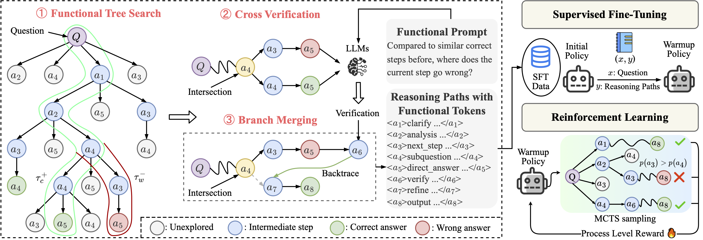
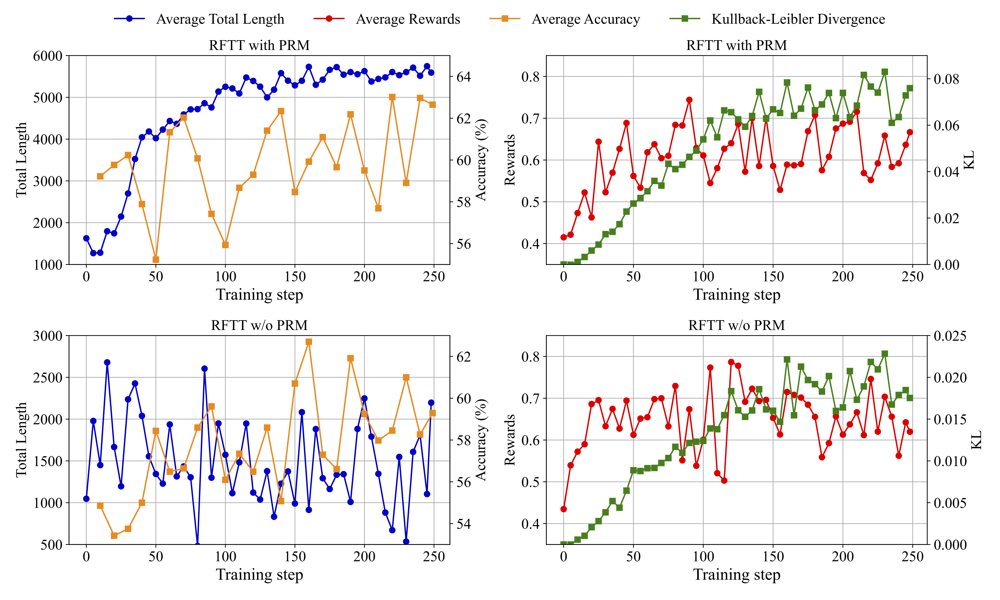

<h1 align="center">Reasoning with Reinforced Functional Token Tuning</h1>

Official codebase for the paper "[Reasoning with Reinforced Functional Token Tuning](https://arxiv.org/abs/2502.13389)".

<div align="center">

</div>

## Overview 

**Abstract:** In this work, we propose ***R*einforced *F*unctional *T*oken *T*uning** (RFTT), a novel reinforced fine-tuning framework that empowers Large Language Models (LLMs) with self-play learn-to-reason capabilities. Unlike prior prompt-driven reasoning efforts, RFTT embeds a rich set of learnable functional tokens (e.g., `<analyze>`, `<verify>`, `<refine>`) directly into the model vocabulary, enabling chain-of-thought construction with diverse human-like reasoning behaviors. Specifically, RFTT comprises two phases: 

- (1) Supervised fine-tuning performs prompt-driven tree search to obtain *self-generated* training data annotated with functional tokens, which warms up the model to learn these tokens for reasoning;
- (2) Online reinforcement learning further allows the model to explore different reasoning pathways through functional token sampling without relying on prompts, thereby facilitating effective *self-improvement* for functional reasoning.

Extensive experiments demonstrate the superiority of the proposed RFTT on mathematical benchmarks, significantly boosting Qwen-2.5-7B-Instruct (70.6% to 79.8%) and LLaMA-3.1-8B-Instruct (32.2% to 60.2%) on the MATH dataset. Moreover, the performance of RFTT consistently improves with more search rollouts at inference time. Our code will be made available.

## News

- **`[Feb 20, 2025]`** 🔥 Our [paper](https://arxiv.org/abs/2502.13389) for **RFTT** has been released!


## Results Preview

<div align="center">

</div>

> The training curve of RFTT with and w/o PRM on Qwen-2.5-7B-Instruct during RL.


## Citation

If you find this work useful for your research, please cite our paper:

```
@article{rftt2025,
      title={Reasoning with Reinforced Functional Token Tuning}, 
      author={Kongcheng Zhang and Qi Yao and Baisheng Lai and Jiaxing Huang and Wenkai Fang and Dacheng Tao and Mingli Song and Shunyu Liu},
      journal={arXiv preprint arXiv:2502.13389},
      year={2025}
}
```

## Acknowledgement
- [LLaMA-Factory](https://github.com/hiyouga/LLaMA-Factory)
- [OpenRLHF](https://github.com/OpenRLHF/OpenRLHF)