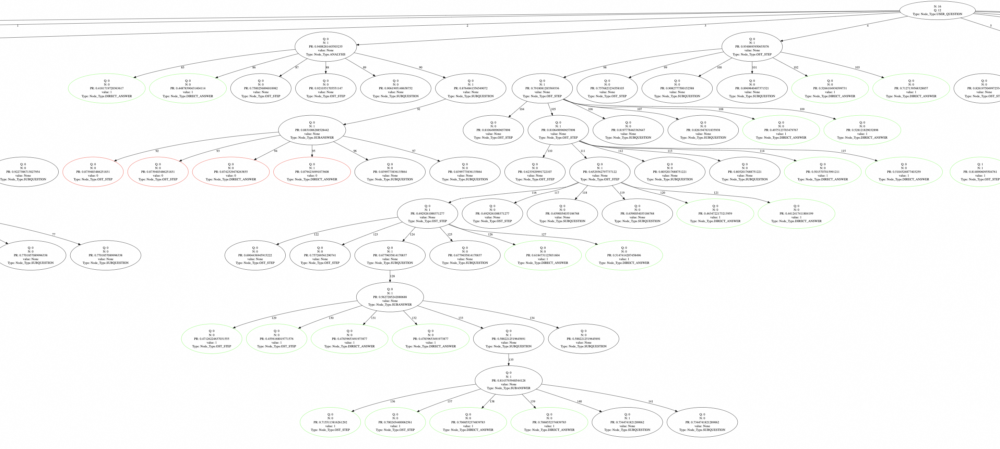

# Reasoning Paths Construction
This is the code base for reasoning paths construction in SFT Warmup stage using functional tree search. The searching tree will be saved in directory `run_outputs`.

Visualization of the searching tree:

