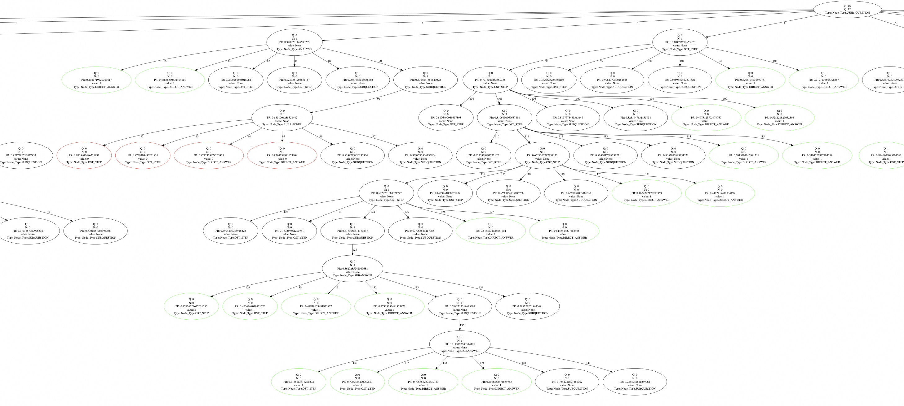

# Reasoning Paths Construction
This is the code base for reasoning paths construction in SFT Warmup stage using functional tree search. The searching tree will be saved in directory `run_outputs`.

## Usage
First deploy the model through vllm:
```bash
CUDA_VISIBLE_DEVICES=0 vllm serve /path/to/Qwen2.5-7B-Instruct --port 8001
```

Next deploy the PRM:
```bash
cd RFTT/gen_data
python prm_api.py
```

Finally run the script:
```bash
sh scripts/tree_search.sh
```

The results will save in the directory `run_outputs`.

| Parameters                 | Description                                                  |
| -------------------------- | ------------------------------------------------------------ |
| `--model_ckpt`               | Name or path of the model for tree search.  |
| `--port`              | Service port of the model.                     |
| `--prm_url`            | The url of the PRM service.             |
| `--max_depth_allowed` | The maximum searching depth allowed in MCTS. |

## Visualize
Use the following command:
```bash
python src/mcts.py # first modify the pkl path
```

Visualization of the searching tree using [this websie](https://dreampuf.github.io/GraphvizOnline/?engine=dot) online:

